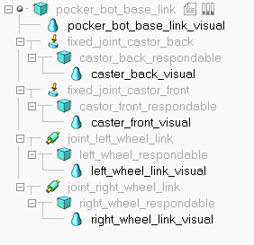

# Pocker_bot_gazebo_vrep_model
This repository contains vrep and gazebo model of pocker_bot

## V-REP model : pocker_bot.ttm

Model is imported using URDF Plugin and respondable bodies are changed accordingly.

## V-REP ROS model : pocker_bot_ros.ttm

On running the simulation following node run:
**/vrep_ros_interface**
+ *Publications*: 
  + `/odom` [nav_msgs/Odometry]
  + /tf

+ *Subscriptions*: 
  + `/cmd_vel` 
  + /reset_pocker_bot 

Run `rosrun teleop_twist_keyboard teleop_twist_keyboard.py` to control the bot using keyboard. The node publish on `cmd_vel` and pocker_bot respond accordingly.

Pocker_bot publishes tf tree (you can turn tf_map2odom and tf_odom2base if you don't want those tf). Pocker_bot publishes the odometry on the topic `/odom`.
Initial position of the pocker_bot can be reset by publishing on the topic `/reset_pocker_bot` which is of type geometry_msgs/Pose2D.

RUn `rviz` to view the tf frames. If you want to see the robot model, download the urdf model of *pocker_bot_description* and load in the parameter server.

